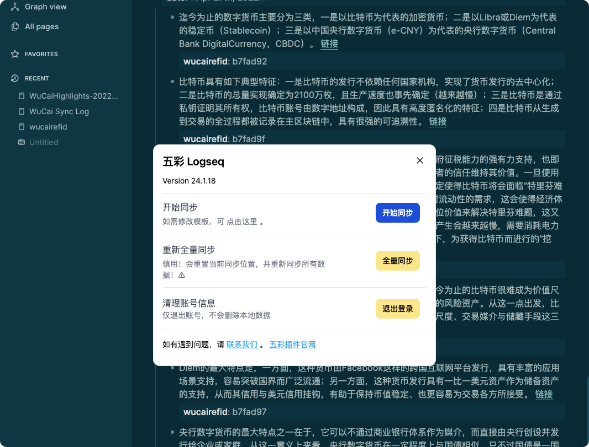

# WuCai Highlights Official
This official plugin maintained by the [五彩](https://doc.wucai.site/) team enables you to easily and automatically export all your digital highlights to [Logseq](https://logseq.com/) .

Note: This plugin requires a subscription with [五彩](https://doc.wucai.site/) — a paid service that makes it easy to aggregate and review all your reading data into one place.

# Feature
* **Continuous, automatic syncing** — Take a highlight to the highlight in your Logseq graph

# Usage
* Install the WuCai Official plugin within Logseq
* Enable the plugin
* Connect the plugin to your WuCai account
* Initiate the first sync
* Thereafter, the plugin can be configured to sync automatically or manually

# Support
* Please see our [feedback](https://www.dotalk.cn/s/3F) 🙂